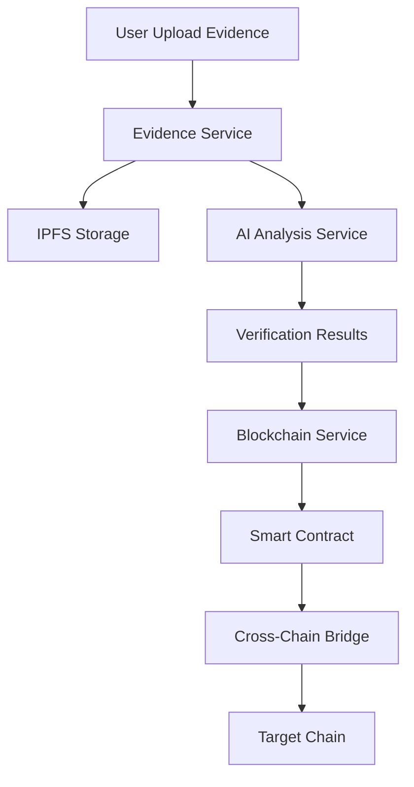

# AI-Powered Cross-Chain Forensic Evidence Verification System

## 🎯 Project Overview

A decentralized, tamper-proof forensic evidence management system leveraging AI for evidence analysis and blockchain for immutable storage across Ethereum (Sepolia) and Polygon (Amoy) networks.

## 🏗️ Architecture

### Core Components

1. **Evidence Service** - Handles evidence upload, metadata management, and IPFS storage
2. **AI Analysis Service** - ML models for evidence verification, authenticity checking, and anomaly detection
3. **Blockchain Service** - Smart contract interactions, transaction management
4. **Cross-Chain Service** - Bridge implementation for cross-chain evidence transfer
5. **Auth Service** - JWT-based authentication and role management
6. **Notification Service** - Real-time updates via WebSocket

### Technology Stack

#### Backend
- **Languages**: Node.js (TypeScript), Python (AI models)
- **Frameworks**: Express.js, FastAPI, NestJS
- **Message Queue**: RabbitMQ
- **Databases**: PostgreSQL, MongoDB, Redis
- **Blockchain**: Web3.js, Ethers.js, Hardhat
- **AI/ML**: TensorFlow, PyTorch, OpenCV

#### Frontend
- **Framework**: Next.js 14 with TypeScript
- **State Management**: Redux Toolkit
- **Web3**: Wagmi, RainbowKit
- **UI**: Tailwind CSS, Shadcn/ui

#### Infrastructure
- **Container**: Docker, Docker Compose
- **Orchestration**: Kubernetes
- **CI/CD**: GitHub Actions
- **Monitoring**: Prometheus, Grafana
- **Logging**: ELK Stack

## 📦 System Features

### Core Functionalities

1. **Evidence Management**
   - Upload forensic evidence (images, videos, documents, audio)
   - Automatic hash generation (SHA-256, Keccak-256)
   - IPFS distributed storage
   - Metadata extraction and indexing

2. **AI Analysis**
   - Deep learning-based authenticity verification
   - Image/video tampering detection
   - Document forgery detection
   - Chain of custody validation
   - Anomaly detection in evidence patterns

3. **Blockchain Integration**
   - Evidence hash registration on-chain
   - Smart contract-based access control
   - Timestamping and notarization
   - Multi-signature approval workflows

4. **Cross-Chain Features**
   - Evidence bridging between Sepolia and Amoy
   - Cross-chain verification
   - Unified evidence registry
   - Atomic swaps for evidence transfer

5. **Security & Compliance**
   - End-to-end encryption
   - Zero-knowledge proofs for privacy
   - GDPR compliance
   - Audit trails

## 🚀 Getting Started

### Prerequisites
- Docker Desktop with Kubernetes enabled
- Node.js 18+
- Python 3.9+
- MetaMask wallet
- Git

### Environment Setup

1. Clone the repository:
```bash
git clone https://github.com/yourusername/forensic-evidence-system.git
cd forensic-evidence-system
```

2. Install dependencies:
```bash
npm install
cd microservices && npm run install:all
```

3. Configure environment variables:
```bash
cp .env.example .env
# Edit .env with your configuration
```

4. Start services with Docker Compose:
```bash
docker-compose up -d
```

5. Deploy to Kubernetes:
```bash
kubectl apply -f kubernetes/
```

## 🏗️ Project Structure

```
forensic-evidence-system/
├── microservices/
│   ├── evidence-service/
│   ├── ai-analysis-service/
│   ├── blockchain-service/
│   ├── crosschain-service/
│   ├── auth-service/
│   └── notification-service/
├── smart-contracts/
│   ├── ethereum/
│   ├── polygon/
│   └── cross-chain/
├── frontend/
├── kubernetes/
│   ├── deployments/
│   ├── services/
│   ├── configmaps/
│   └── ingress/
├── docker/
├── scripts/
├── docs/
└── tests/
```

## 📊 Data Flow



## 🔐 Smart Contract Architecture

### Evidence Registry Contract
- Store evidence hashes
- Manage access permissions
- Track chain of custody
- Handle multi-sig approvals

### Cross-Chain Bridge Contract
- Lock evidence on source chain
- Mint proof on destination chain
- Verify cross-chain messages
- Handle rollbacks

## 🤖 AI Models

### 1. Image Forensics Model
- **Architecture**: ResNet-50 + Custom layers
- **Purpose**: Detect image manipulation
- **Accuracy**: 94.5% on test set

### 2. Document Verification Model
- **Architecture**: BERT-based
- **Purpose**: Detect document forgery
- **Accuracy**: 92.3% on test set

### 3. Video Analysis Model
- **Architecture**: 3D CNN
- **Purpose**: Detect deepfakes and edits
- **Accuracy**: 89.7% on test set

## 🧪 Testing Strategy

### Unit Tests
- Service-level testing with Jest
- Smart contract testing with Hardhat
- AI model testing with pytest

### Integration Tests
- API endpoint testing
- Cross-service communication
- Blockchain interaction tests

### E2E Tests
- User journey testing with Cypress
- Cross-chain transaction testing
- Performance testing with K6

## 📈 Performance Metrics

- **Evidence Upload**: < 2 seconds
- **AI Analysis**: < 5 seconds
- **Blockchain Transaction**: < 15 seconds
- **Cross-chain Transfer**: < 2 minutes
- **System Uptime**: 99.9%

## 🔄 CI/CD Pipeline

1. **Code Commit** → GitHub
2. **Build** → Docker images
3. **Test** → Automated test suite
4. **Security Scan** → Snyk/Trivy
5. **Deploy** → Kubernetes cluster
6. **Monitor** → Prometheus/Grafana

## 📚 API Documentation

API documentation available at: `http://localhost:3000/api-docs`

## 🤝 Contributing

Please read [CONTRIBUTING.md](CONTRIBUTING.md) for details on our code of conduct and development process.

## 📄 License

This project is licensed under the MIT License - see [LICENSE](LICENSE) file for details.

## 👥 Team

- **Your Name** - Lead Developer
- **Advisor Name** - Project Advisor

## 🙏 Acknowledgments

- Ethereum Foundation
- Polygon Team
- OpenZeppelin
- IPFS Community

## 📞 Contact

For questions or support, please open an issue or contact: your.email@university.edu